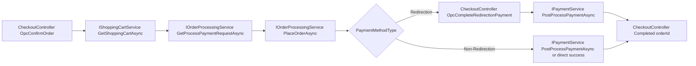

### Architecture Analysis (Before Instrumentation)

## Architecture Analysis – Layer Organisation and Dependencies

The nopCommerce architecture follows a **layered structure** where responsibilities are separated across several projects. Each layer depends only on specific lower layers, forming a mostly unidirectional dependency flow.

### Layer Structure

The main layers are organised as follows:

- **Core**
- **Data**
- **Services**
- **Web (Presentation)**

Dependency direction:

(as de cima consomem as de baixo)
Web / Web.Framework
      ↓
   Services
      ↓
     Data
      ↓
     Core


Core: não depende de outras camadas (“Core nada”).

Data → Core: a camada de persistência depende do Core (entidades/contratos/base types).
    <ProjectReference Include="..\Nop.Core\Nop.Core.csproj" />

Services → Data, Core: a camada de negócio usa o Core e acessa persistência via Data.

Web (Presentation) → Services, Data, Core (+ Web Framework): o entrypoint web referencia Services para lógica de negócio e também tem dependências diretas com Data/Core.

Web.Framework / Web.Framework.Services → Services, Data, Core: componentes do framework UI e serviços auxiliares também dependem das camadas internas.

Note:

In a typical layered architecture, the Web layer would depend only on the Services layer, which would then access the Data layer. However, in nopCommerce the Web project also references the Data project directly. This means that some requests may access the data layer without passing through the service layer.
From an observability perspective, this requires instrumentation not only in the service layer but also at the HTTP entry point and database access level to ensure complete traces.


(examples is missing, exemplo de cada dependencia de codigo)
----------------------

## IEventPublisher

`IEventPublisher` é o contrato que o nopCommerce usa para publicar eventos internos da aplicação.

```csharp
public partial interface IEventPublisher
{
    Task PublishAsync<TEvent>(TEvent @event);
}
```

### O que isto significa

- `partial`: permite dividir a interface em vários ficheiros, mas neste projeto ela está apenas neste ficheiro.
- `Task`: o método é assíncrono.
- `PublishAsync<TEvent>`: publica um evento do tipo `TEvent`.
- `@event`: instância concreta do evento a publicar.

### Como o nopCommerce processa os eventos internamente

A implementação está em `EventPublisher`. Quando `PublishAsync` é chamado, o nopCommerce:

1. Resolve no DI todos os `IConsumer<TEvent>` registados para aquele evento.
2. Executa os consumers de forma sequencial (`await`).
3. Se um consumer falhar, faz log da exceção e continua para o próximo.
4. Se o evento implementar `IStopProcessingEvent` e `StopProcessing = true`, interrompe o pipeline.

```csharp
public virtual async Task PublishAsync<TEvent>(TEvent @event)
{
    var consumers = EngineContext.Current.ResolveAll<IConsumer<TEvent>>().ToList();

    foreach (var consumer in consumers)
    {
        try
        {
            await consumer.HandleEventAsync(@event);

            if (@event is IStopProcessingEvent { StopProcessing: true })
                break;
        }
        catch (Exception exception)
        {
            try
            {
                var logger = EngineContext.Current.Resolve<ILogger>();
                if (logger == null)
                    return;

                await logger.ErrorAsync(exception.Message, exception);
            }
            catch
            {
                // ignored
            }
        }
    }
}
```

### Como o DI entra neste fluxo

O DI (Dependency Injection) é o contentor que sabe:

- que implementação usar para cada interface;
- como criar objetos e respetivas dependências;
- que consumers existem para cada tipo de evento.

No startup, o nopCommerce regista o publisher e faz scan automático dos consumers:

```csharp
services.AddSingleton<IEventPublisher, EventPublisher>();

var consumers = typeFinder.FindClassesOfType(typeof(IConsumer<>)).ToList();
foreach (var consumer in consumers)
foreach (var findInterface in consumer.FindInterfaces((type, criteria) =>
         {
             var isMatch = type.IsGenericType &&
                           ((Type)criteria).IsAssignableFrom(type.GetGenericTypeDefinition());
             return isMatch;
         }, typeof(IConsumer<>)))
    services.AddScoped(findInterface, consumer);
```

Assim, quando um evento é publicado, os consumers certos já estão registados e são executados automaticamente. (HandleEventAsync)

### Exemplos de eventos publicados no nopCommerce

```csharp
await _eventPublisher.PublishAsync(new AdminMenuCreatedEvent(this, root));
await eventPublisher.PublishAsync(new AppStartedEvent());
```

### Resumo

`IEventPublisher` desacopla quem publica de quem consome:

- quem publica só dispara o evento;
- quem consome implementa `IConsumer<TEvent>`;
- o DI liga tudo automaticamente.


## Easy To Add Observability

### Easy Places (Good observability hooks)

- HTTP pipeline is centralized, so one middleware can capture request/response timing, status, and correlation IDs for almost everything web-facing.  
  `ApplicationBuilderExtensions.cs`
- Error handling is already centralized (exceptions, 400, 404), so logging and trace enrichment can be standardized there.  
  `ErrorHandlerStartup.cs`
- Event publishing is centralized in one dispatcher, so you can instrument event fan-out once (event type, consumer count, failures, duration).  
  `EventPublisher.cs`
- Repository CRUD is centralized in `EntityRepository`, so DB-level business operations can be traced from one place.  
  `EntityRepository.cs`

### Hard Places (Observability gaps)

- `EngineContext.Current.Resolve(...)` (service locator style) hides dependency flow, making spans and causality harder to reason about.  
  `NopEngine.cs`
- Dynamic plugin/event discovery means behavior is runtime-composed; hard to know all handlers statically.  
  `NopStartup.cs`
- Non-HTTP flows (scheduled tasks) bypass HTTP middleware, so you need separate instrumentation paths.  
  `TaskScheduler.cs`
- Static file and some middleware short-circuit paths bypass controllers/services, so controller-level telemetry alone is incomplete.  
  `ApplicationBuilderExtensions.cs`

### Structural Changes Needed For Proper Instrumentation

- Add OpenTelemetry `ActivitySource` at 4 choke points: HTTP middleware, event publisher, repository operations, schedule task runner.
- Standardize correlation context propagation across HTTP, events, and background jobs.
- Gradually reduce new uses of service locator and prefer constructor DI in touched code paths.
- Define a telemetry contract (span names, tags, error semantics) so plugins/core emit consistent signals.

### Is It Worth Making These Changes?

Yes.

High-value, low-risk first phase is absolutely worth it: instrument centralized choke points without large refactors.

Full architectural cleanup (removing service locator broadly) is also valuable, but should be incremental and justified by long-term maintenance and diagnostic needs.


## User Flow Selected

Customer places an order

### Why??

- É o fluxo com maior impacto de negócio e maior risco operacional.
- Se o catálogo estiver lento, o cliente ainda pode esperar; se o pagamento falhar, a venda perde-se.
- Permite detetar degradação antes de falhas visíveis (timeouts, retries, gateway errors).
- Tem uma cadeia técnica mais complexa:
  frontend de checkout, validações, criação de order, comunicação com gateway externo e atualização de estado.
- Quanto mais etapas existem, maior a probabilidade de falha e maior o valor de observabilidade ponta a ponta.
- Depende de terceiros (ex.: PayPal/Stripe), por isso a telemetria é essencial para distinguir:
  falha no nosso código, problema de rede ou indisponibilidade do provider.
- A latência é crítica: mesmo sem erro, checkout lento aumenta abandono.
- Por isso este fluxo deve ser observado com métricas de percentis (p95/p99), e não apenas com taxa de erro.

## Flow that allows

password: arquiteurasoftware




## Metrics

### 1) Checkout Throughput (5m)
**Description:** Number of checkout attempts in the last 5 minutes, split by result (`success`, `failed`, etc.).

```promql
sum by (result) (increase(checkout_attempts_total[5m]))
```

### 2) Checkout Error Rate (5m)
**Description:** Percentage of checkout attempts that failed in the last 5 minutes.

```promql
sum(increase(checkout_attempts_total{result!="success"}[5m])) / sum(increase(checkout_attempts_total[5m]))
```

### 3) Checkout p95 Duration (5m)
**Description:** p95 latency of checkout confirmation flow. Detects degradation before visible failures.

```promql
histogram_quantile(0.95, sum(rate(checkout_duration_seconds_bucket[5m])) by (le))
```

### 4) Checkout Average Duration (5m)
**Description:** Average checkout confirmation latency trend over the last 5 minutes.

```promql
sum(rate(checkout_duration_seconds_sum[5m])) / sum(rate(checkout_duration_seconds_count[5m]))
```

### 5) Payment Attempts by Provider/Method/Result (5m)
**Description:** Number of payment attempts in the last 5 minutes, split by provider, payment method type, and result.

```promql
sum by (provider, method, result) (increase(payment_attempts_total[5m]))
```

### 6) Payment p95 Latency by Provider (5m)
**Description:** p95 payment processing latency by provider. Useful to detect gateway-level degradation.

```promql
histogram_quantile(0.95, sum(rate(payment_latency_seconds_bucket[5m])) by (le, provider))
```

### 7) Payment Failures by Reason (5m)
**Description:** Payment failures in the last 5 minutes grouped by provider and normalized reason code.

```promql
sum by (provider, reason_code) (increase(payment_failures_total[5m]))
```

### 8) Checkout Drop-off at Confirm Step (5m)
**Description:** Checkout drop-offs at confirm order step, grouped by reason code.

```promql
sum by (step, reason_code) (increase(checkout_step_dropoff_total[5m]))
```

