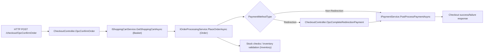

# Architecture Analysis and Instrumentation Rationale

## 1) Layer Organization and Dependency Rules

I analyzed nopCommerce from the inside out: first `Nop.Core`, then `Nop.Services`, then the web host and startup composition.  
The goal was not only to map dependencies, but to identify where operational behavior is actually decided.

### Layer map

- `Nop.Core`: contracts, domain primitives, shared infrastructure abstractions.
- `Nop.Data`: repository implementation, DB provider abstractions, migrations.
- `Nop.Services`: business orchestration (checkout, order lifecycle, payment paths, stock checks).
- `Nop.Web.Framework`: web infrastructure and startup modules (`INopStartup` units).
- `Nop.Web`: host process, controllers, HTTP entry points.

### Dependency direction

`Nop.Web / Nop.Web.Framework -> Nop.Services -> Nop.Data -> Nop.Core`

### Evidence from project references

`Nop.Core` is the base layer and does not depend on other nop layers (`src/Libraries/Nop.Core/Nop.Core.csproj`).  
Clear example of core contracts used by upper layers:

```csharp
// src/Libraries/Nop.Core/Events/IEventPublisher.cs
public partial interface IEventPublisher
{
    Task PublishAsync<TEvent>(TEvent @event);
}
```

`Nop.Data` depends on `Nop.Core` (`src/Libraries/Nop.Data/Nop.Data.csproj`) and implements persistence concerns (repositories, provider, migrations).  
Concrete data-layer example:

```csharp
// src/Libraries/Nop.Data/EntityRepository.cs
await _dataProvider.InsertEntityAsync(entity);
if (publishEvent)
    await _eventPublisher.EntityInsertedAsync(entity);
```

`Nop.Services` depends on `Nop.Core` and `Nop.Data` (`src/Libraries/Nop.Services/Nop.Services.csproj`) and owns orchestration/business rules.  
Concrete service-layer example:

```csharp
// src/Libraries/Nop.Services/Orders/OrderService.cs
await _orderRepository.InsertAsync(order);
```

`Nop.Web.Framework` depends on `Nop.Core`, `Nop.Data`, and `Nop.Services` (`src/Presentation/Nop.Web.Framework/Nop.Web.Framework.csproj`) and wires startup/DI/web pipeline behaviors.  
Concrete framework-layer example:

```csharp
// src/Presentation/Nop.Web.Framework/Infrastructure/NopStartup.cs
services.AddSingleton<IEventPublisher, EventPublisher>();
```

`Nop.Web` depends on all previous layers (`src/Presentation/Nop.Web/Nop.Web.csproj`) and is the runtime host with HTTP entrypoints/controllers.  
Concrete web-layer example:

```csharp
// src/Presentation/Nop.Web/Controllers/CheckoutController.cs
var placeOrderResult = await _orderProcessingService.PlaceOrderAsync(processPaymentRequest);
```

### What this means in runtime terms

A checkout request crosses multiple boundaries:

```csharp
// Web entrypoint
var placeOrderResult = await _orderProcessingService.PlaceOrderAsync(processPaymentRequest);
```

```csharp
// Service orchestration
await _orderService.InsertOrderAsync(order);
```

```csharp
// Data boundary
await _orderRepository.InsertAsync(order);
```

So, even in a layered architecture, end-to-end observability must include:

1. HTTP request boundary (`Nop.Web`),
2. service orchestration boundary (`Nop.Services`),
3. persistence boundary (`Nop.Data`).

If only services are instrumented, we lose request context and DB visibility.

---

## 2) Internal Event Mechanism (`IEventPublisher`)

`IEventPublisher` is nopCommerce’s internal in-process event bus:

```csharp
public partial interface IEventPublisher
{
    Task PublishAsync<TEvent>(TEvent @event);
}
```

This contract is intentionally minimal: publishers emit a typed event and know nothing about concrete handlers.  
That keeps business modules decoupled, but it also hides runtime fan-out and side effects unless we instrument the dispatch path.

### What it is (and what it is not)

- It is an **in-process asynchronous publish/subscribe mechanism**.
- It is **not** an external broker (no Kafka/RabbitMQ semantics, no durability guarantees).
- It is a **cross-cutting orchestration backbone** used by persistence lifecycle and domain workflows.

Architectural consequence: checkout behavior is not only the direct call chain (`Controller -> Service -> Repository`); part of the outcome is produced by event consumers resolved at runtime.

### Dispatch lifecycle in practice

Implementation: `src/Libraries/Nop.Services/Events/EventPublisher.cs`

`PublishAsync<TEvent>` does four important things:

1. resolves all `IConsumer<TEvent>` handlers from DI,
2. executes them asynchronously in sequence,
3. catches/logs handler exceptions and continues,
4. can stop chain execution with `IStopProcessingEvent`.

This means a single business action can trigger multiple downstream handlers with different latency and failure profiles.  
Because handlers are resolved dynamically, the same code path can have different runtime cost across environments (different plugins/modules enabled).

Registration/discovery path:

- publisher: `services.AddSingleton<IEventPublisher, EventPublisher>()`
- consumers: discovered dynamically from `IConsumer<>` implementations

Files:

- `src/Presentation/Nop.Web.Framework/Infrastructure/NopStartup.cs`
- `src/Libraries/Nop.Services/Events/EventPublisher.cs`

### Event categories involved in checkout

In the selected flow, two classes of events appear:

1. **Infrastructure lifecycle events**  
   Raised around entity persistence (e.g., insert/update patterns via repository path).
2. **Business/domain events**  
   Raised by orchestration logic (e.g., order placed).

So one HTTP checkout request can produce multiple internal events with different business meaning and operational impact.

### Concrete checkout event path (code-level)

In the selected flow:

```csharp
// Controller -> service orchestration
var placeOrderResult = await _orderProcessingService.PlaceOrderAsync(processPaymentRequest);
```

During save:

```csharp
// Repository insert
await _dataProvider.InsertEntityAsync(entity);
if (publishEvent)
    await _eventPublisher.EntityInsertedAsync(entity);
```

Business event publication also occurs in order processing:

```csharp
// Domain event
await _eventPublisher.PublishAsync(new OrderPlacedEvent(order));
```

Result: one request emits both infrastructure lifecycle events and business events.  
That is exactly where tracing and metrics must connect.

### Why this is a primary observability boundary

One instrumentation point at `PublishAsync` gives high-value cross-domain signals:

- event rate by type,
- fan-out size (number of consumers),
- per-consumer latency impact,
- hidden handler failures.

This is especially important because consumer discovery is dynamic. Without telemetry, fan-out cost is opaque and regressions are hard to localize.

### Failure semantics and why they matter

`EventPublisher` can log consumer exceptions and continue dispatching.  
Operationally, this creates an important class of failures: **partial success**.

- User-visible checkout may return success,
- but one or more side effects (notifications, integrations, downstream updates) may fail.

Without explicit telemetry on consumer execution, these failures remain mostly in logs and are hard to correlate with the original checkout trace.

### Instrumentation strategy justified by architecture

For this mechanism, the best surgical approach is boundary instrumentation (not deep refactoring of every service):

1. trace spans around event publish and consumer execution,
2. metrics for event throughput, consumer failures, and consumer latency,
3. low-cardinality labels only (`event_type`, `consumer`, `result`, `reason_code`),
4. strict PII exclusion from attributes/tags.

Why this is the right trade-off:

- **high coverage:** one boundary sees many domains,
- **low risk:** no change to business semantics,
- **high diagnostic value:** reveals hidden fan-out cost and partial-failure patterns.

Implementation note for this assignment: the delivered code now instruments `EventPublisher` directly with spans for publish and per-consumer execution, while still keeping the change at the boundary rather than inside each business service.  
This kept the approach surgical but made dynamic fan-out visible in traces.

In short, `IEventPublisher` is not just an implementation detail; it is a runtime coupling point where architectural decoupling turns into operational complexity.

---

## 3) Where Observability Is Easy vs Hard

### Easy points (high coverage with low change risk)

1. **Composition root (`Program.cs`)**  
   Single place to configure traces, metrics, resource metadata, and exporter destination.
   This gives full app-level consistency (same service name, same exporter, same sampling policy).
   Practical effect: one startup change enables telemetry for all HTTP requests and all internal instrumentation.
   Observability value: strong governance point (sampling, processor policies, sanitization defaults).

2. **Ordered startup model (`INopStartup.Order`)**  
   Startup units are discovered and executed in deterministic order (`NopEngine` + `INopStartup.Order`), which reduces uncertainty in middleware instrumentation.
   Practical effect: easier to reason about where spans start/end in request lifecycle.
   Observability value: predictable initialization order reduces "missing instrumentation" caused by startup race/order issues.

3. **Repository boundary (`EntityRepository`)**  
   Data access is centralized and already coupled with lifecycle events.
   Example:
   ```csharp
   await _dataProvider.InsertEntityAsync(entity);
   if (publishEvent)
       await _eventPublisher.EntityInsertedAsync(entity);
   ```
   Practical effect: one instrumentation point can cover persistence latency plus post-persist side effects.
   Observability value: joins DB behavior and event emission in the same boundary, which is ideal for checkout root-cause analysis.

4. **Event dispatcher (`EventPublisher`)**  
   Fan-out happens in one class and all consumers pass through the same dispatch path.
   Practical effect: low-effort instrumentation for event throughput, handler latency, and handler failures.
   Observability value: high diagnostic leverage with minimal code churn.

### Hard points (where blind spots appear)

1. **Runtime plugin loading + reflection**  
   Runtime behavior depends on loaded plugins and type scanning, so static call-graph analysis is incomplete.
   Risk: coverage gaps if instrumentation assumes only built-in modules are active.
   Operational impact: two environments can show different latency/error profiles for the same request path.

2. **Dynamic event consumers**  
   `IConsumer<>` handlers are discovered dynamically; fan-out can change between environments.
   Risk: variable latency and variable side-effect behavior for the same business action.
   Operational impact: p95 can degrade with no controller/service code changes, only by enabling/disabling modules.

3. **Background/non-request operations**  
   Scheduled tasks and non-HTTP operations do not automatically inherit request trace context.
   Risk: traces can appear fragmented if explicit root spans are not created.
   Operational impact: difficult correlation between checkout outcomes and delayed side effects.

4. **Exception swallowing in event handlers**  
   Event dispatch logs exceptions and keeps processing downstream consumers.
   Risk: user request may appear successful while background side effects partially fail.
   Without dedicated metrics, these failures remain mostly log-only signals.

5. **Cross-layer references in presentation projects**  
   `Nop.Web` and `Nop.Web.Framework` reference lower layers directly.
   Risk: some flows can bypass expected service orchestration paths, so instrumentation must include entrypoint and DB boundaries, not only service methods.

### Architectural reading outcome for instrumentation

Given these easy/hard points, a full method-level instrumentation strategy would create noise and maintenance burden.  
The defensible strategy for this codebase is **boundary-first instrumentation**:

1. instrument ingress (`HTTP`),
2. instrument orchestration checkpoints in checkout controllers,
3. instrument persistence (`SqlClient` boundary),
4. keep event-dispatch instrumentation as a follow-up improvement if deeper fan-out diagnostics are required.

This directly addresses the hard points above:

- dynamic plugins/events -> partially mitigated by boundary telemetry and explicit event-path analysis,
- partial-success behavior -> exposed by failure counters and trace errors at boundaries,
- cross-layer call variability -> controlled by always instrumenting entry + DB + checkout decision points.

### Why this matters for assignment quality

This is not only a technical choice; it is an architectural argument:

- **Surgical change discipline:** minimal invasive edits on an inherited production codebase.
- **Operational usefulness:** on-call engineers can answer "where did checkout fail: basket, inventory, payment, or latency?" quickly.
- **Metric quality:** low-cardinality, action-oriented telemetry instead of broad noisy instrumentation.

---

## 4) Structural Changes Needed to Instrument Properly (and if Worth It)

I followed a surgical strategy: instrument boundaries, not business internals.

### Changes I considered necessary

1. **Configure OpenTelemetry once in host startup (`Program.cs`)**  
   Why: prevents duplicated configuration across modules and keeps exporter/sampler policy centralized.

2. **Use a focused metrics helper (`CheckoutTelemetry`)**  
   Why: keeps metric names/tags consistent and avoids scattered ad-hoc counters in controller logic.

3. **Enable explicit SQL tracing (`SqlClient`)**  
   Why: guarantees assignment requirement `HTTP -> service -> DB` is observable end-to-end.

4. **Instrument checkout boundaries, not all service methods**  
   Why: lower code churn and better signal/noise ratio than span-per-method instrumentation.

5. **Standardize low-cardinality technical tags only**  
   Used tags: `flow`, `result`, `reason_code`, `provider`, `method`, `payment_method`.  
   Why: keeps Prometheus series count controlled and avoids cardinality explosions.

6. **PII-safe telemetry discipline**  
   Excluded from tags: email, address, phone, names, payment details.  
   Why: aligns with assignment constraints and production-safe telemetry governance.

### Changes I intentionally did not do (and why)

- I did **not** refactor core business services to inject tracing everywhere.  
  Reason: high regression risk and unnecessary for assignment scope.

- I did **not** modify event bus semantics (e.g., changing error handling policy).  
  Reason: behavioral impact would be architectural, not observability-only.

- I did **not** add high-cardinality labels (order ID, customer ID, raw exception message).  
  Reason: operationally expensive and bad for long-term metrics quality.

### Why this trade-off is correct

- Minimal regression risk (surgical, localized changes).
- Strong operational visibility for the selected critical flow.
- Clear architectural defensibility: no business behavior rewrite, only cross-cutting observability boundaries.
- Good maintenance profile: easy to extend later to other flows without redesign.

In short: this approach respects nopCommerce’s current design and still gives actionable observability.

---

# Selected Flow

## Customer places an order (Basket · Order · Payment · Inventory)

### Why this flow

- Highest business impact path.
- Strong operational risk (payment + stock + order creation).
- Clear end-to-end orchestration suitable for traces and metrics.

## Flow Diagram



---

# Instrumentation Coverage

## Distributed tracing

Implemented coverage:

- HTTP inbound spans (`AspNetCore` instrumentation),
- outbound HTTP spans (`HttpClient` instrumentation),
- DB spans (`SqlClient` instrumentation).

Tracing is primarily automatic (framework instrumentation) and correlated with checkout-specific custom metrics emitted at controller decision points.

Target chain covered:

`HTTP entry -> service calls -> database`

## Sensitive data exclusion

Custom telemetry tags are technical only:

- `flow`, `result`, `error_type`, `reason_code`,
- `provider`, `method`, `payment_method`.

Excluded intentionally:

- email, name, address, phone, payment details, cart contents.

---

# Metrics

## Dashboard Row 1: Checkout Health

### Panel: Checkout Throughput (5m)
- **What it shows:** checkout volume by outcome (`success`, `failed`).
- **PromQL:**
```promql
sum by (result) (increase(checkout_attempts_total[5m]))
```
- **If abnormal:**  
  If total throughput drops, check app availability, endpoint health, and incoming traffic.
- **Correlate in Jaeger:**  
  `service=nop.web`, `operation=POST`; verify traces still arrive for checkout requests.

### Panel: Checkout Error Rate (5m)
- **What it shows:** failure ratio of checkout in the last 5 minutes.
- **PromQL:**
```promql
sum(increase(checkout_attempts_total{result!="success"}[5m])) / sum(increase(checkout_attempts_total[5m]))
```
- **If abnormal:**  
  Use payment/basket/inventory failure panels to find which subsystem is driving errors.
- **Correlate in Jaeger:**  
  Inspect failed traces at the same timestamp and identify the failing branch.

### Panel: Checkout p95 Duration (5m)
- **What it shows:** tail latency of checkout (95th percentile).
- **PromQL:**
```promql
histogram_quantile(0.95, sum(rate(checkout_duration_seconds_bucket[5m])) by (le))
```
- **If abnormal:**  
  If p95 rises before error rate, treat as early degradation; compare with payment p95 and DB spans.
- **Correlate in Jaeger:**  
  Open slow traces and identify longest spans (payment, DB, or controller path).

### Panel: Checkout Average Duration (5m)
- **What it shows:** average checkout latency trend.
- **PromQL:**
```promql
sum(rate(checkout_duration_seconds_sum[5m])) / sum(rate(checkout_duration_seconds_count[5m]))
```
- **If abnormal:**  
  Use with p95: if both rise, broad slowdown; if only p95 rises, tail-only issue.
- **Correlate in Jaeger:**  
  Compare normal traces vs slow traces to see whether degradation is global or selective.

## Dashboard Row 2: Payment Reliability

Environment note (important for interpretation): in this assignment setup, nopCommerce is using an offline/local payment method (for example `Payments.CheckMoneyOrder`) and no external gateway (Stripe/PayPal) is called during checkout.  
Because of that, provider-dependent metrics such as `payment_failures_total` can legitimately remain at `0` or show limited variability. This is expected behavior in this environment, not an instrumentation gap.

Demo note (important): in this repository demo, `payment_attempts_total` and `payment_latency_seconds` should still show data whenever the success scenario runs, while `payment_failures_total` may remain `0` or `No data` for some runs/time windows.  
This should be presented as an environment characteristic of the offline/local payment path, not as missing instrumentation.

These metrics were kept intentionally because they are production-readiness signals: once a real gateway is enabled, the same dashboard immediately shows provider-specific latency degradation and failure patterns.  
For the live demo in this repository, the strongest actionable signals are checkout-level metrics (`checkout_attempts_total`, error rate, p95 duration, and drop-off reasons), which do change clearly under load and controlled failure scenarios.

### Panel: Payment Attempts by Provider/Method/Result (5m)
- **What it shows:** payment attempts split by provider, method, and result.
- **PromQL:**
```promql
sum by (provider, method, result) (increase(payment_attempts_total[5m]))
```
- **If abnormal:**  
  If one provider has rising `failed`, start by checking that provider integration.
- **Correlate in Jaeger:**  
  Filter traces that include payment spans and confirm provider-specific behavior.

### Panel: Payment p95 Latency by Provider (5m)
- **What it shows:** tail payment latency per provider.
- **PromQL:**
```promql
histogram_quantile(0.95, sum(rate(payment_latency_seconds_bucket[5m])) by (le, provider))
```
- **If abnormal:**  
  High p95 on one provider indicates gateway/network/provider stress.
- **Correlate in Jaeger:**  
  Inspect traces where payment span dominates total request duration.

### Panel: Payment Failures by Reason (5m)
- **What it shows:** failures grouped by `provider` and normalized `reason_code`.
- **PromQL:**
```promql
sum by (provider, reason_code) (increase(payment_failures_total[5m]))
```
- **If abnormal:**  
  Investigate the dominant `reason_code` first (fastest route to root cause).
- **Correlate in Jaeger:**  
  Confirm same failure signature in exception/error span attributes.

## Dashboard Row 3: Behavior / Drop-off / Domain Signals

### Panel: Checkout Drop-off at Confirm Step (5m)
- **What it shows:** users dropping/failing at confirm step by reason.
- **PromQL:**
```promql
sum by (step, reason_code) (increase(checkout_step_dropoff_total[5m]))
```
- **If abnormal:**  
  Confirms checkout UX/validation issue near final step; map top reason to code path.
- **Correlate in Jaeger:**  
  Inspect `OpcConfirmOrder` traces and exception paths.

### Panel: Basket Checkout Failures (5m)
- **What it shows:** checkout failures caused by basket/cart issues.
- **PromQL:**
```promql
sum by (flow, reason_code) (increase(basket_checkout_failures_total[5m]))
```
- **If abnormal:**  
  Check cart/session continuity and item state before place-order.
- **Correlate in Jaeger:**  
  Find traces terminating before successful order placement with basket-related reason.

### Panel: Inventory Checkout Failures (5m)
- **What it shows:** checkout failures caused by stock/inventory constraints.
- **PromQL:**
```promql
sum by (flow, reason_code) (increase(inventory_checkout_failures_total[5m]))
```
- **If abnormal:**  
  Check stock consistency, reservation rules, and sync jobs.
- **Correlate in Jaeger:**  
  Inspect traces where place-order fails on stock validation.

---

# Run and Validation

Execution and dashboard validation steps are maintained in [README.md](/home/tomasbras/Desktop/AS/Project/AS_Project-1/README.md) to avoid duplication and keep this document focused on architecture and instrumentation rationale.

Validation interpretation remains the same:

- if payment panels/queries are `0` or `No data` while checkout/basket/inventory signals are active, this is expected in the local/offline payment environment used in this repository;
- this is an environment characteristic, not an instrumentation failure.
