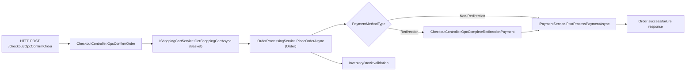
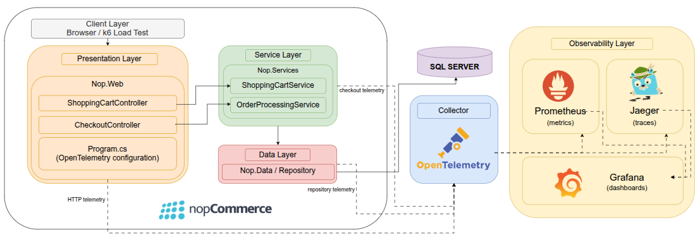

# Assignment 01 - Observability in the Wild

| Student | NMEC |
| --- | --- |
| Tomás Rafael Marques Brás | 112665 |

OpenTelemetry instrumentation for nopCommerce, focused on the flow:

**Customer places an order (Basket -> Order -> Payment -> Inventory)**.

This repository contains:
- architecture analysis: `ARCHITECTURE.md`
- critique: `CRITIQUE.md`
- load test script: `load-tests/checkout-opc.js`
- observability stack: `opentelemetry-demo/docker-compose.observability.yml`

---

## 1) Prerequisites

- Docker + Docker Compose
- .NET SDK 9 (or local SDK path configured)
- k6
- SQL Server running for nopCommerce

If using local .NET 9 SDK in home folder:

```bash
export DOTNET_ROOT=/home/tomasbras/dotnet-sdk-9.0.312-linux-x64
export PATH=$DOTNET_ROOT:$PATH
```

---

## 2) Run Observability Stack

```bash
docker compose -f opentelemetry-demo/docker-compose.observability.yml up -d
```

Endpoints:
- Grafana: `http://localhost:3000`
- Prometheus: `http://localhost:9090`
- Jaeger: `http://localhost:16686`
- OTEL Collector OTLP gRPC: `http://localhost:4317`

---

## 3) Run SQL Server for nopCommerce

nopCommerce in this repo is configured to use SQL Server at `localhost:1433` (`src/Presentation/Nop.Web/App_Data/appsettings.json`).

If you do not already have SQL Server running locally, start it with Docker:

```bash
docker run -d \
  --name nopcommerce_mssql_server \
  -e ACCEPT_EULA=Y \
  -e SA_PASSWORD='nopCommerce_db_password' \
  -p 1433:1433 \
  mcr.microsoft.com/mssql/server:2019-latest
```

If the container already exists:

```bash
docker start nopcommerce_mssql_server
```

Optional check:

```bash
docker logs -f nopcommerce_mssql_server
```

Wait until SQL Server reports it is ready for client connections.

---

## 4) Run nopCommerce with OpenTelemetry

From repository root:

```bash
OTEL_EXPORTER_OTLP_ENDPOINT=http://localhost:4317 \
dotnet run --project src/Presentation/Nop.Web/Nop.Web.csproj
```

Store URL:
- `http://localhost:5000`

Tracing notes:
- automatic spans: ASP.NET Core, SQL client, outbound HTTP
- custom business spans: `checkout.place_order`, `checkout.payment.post_process`, `checkout.payment.redirection_complete`, `event.publish`, `event.consume`
- sanitization: exported spans pass through a processor that removes potentially sensitive attributes before they leave the process

---

## 5) Selected Flow Diagram



## 5.1) Observability Architecture Diagram



---

## 6) Run Load Test (k6)

The script drives three checkout scenarios:
- `opc_success`
- `opc_basket_failure`
- `opc_inventory_failure`

Recommended product setup:
- success path: `SUCCESS_PRODUCT_ID=18`
- inventory failure path: `INVENTORY_PRODUCT_ID=48`

Quick validation run:

```bash
BASE_URL=http://localhost:5000 \
SUCCESS_PRODUCT_ID=18 \
SUCCESS_STAGE_1_DURATION=20s \
SUCCESS_STAGE_1_TARGET=1 \
SUCCESS_STAGE_2_DURATION=40s \
SUCCESS_STAGE_2_TARGET=1 \
SUCCESS_STAGE_3_DURATION=20s \
SUCCESS_STAGE_3_TARGET=0 \
BASKET_FAILURE_VUS=0 \
INVENTORY_FAILURE_VUS=0 \
k6 run load-tests/checkout-opc.js
```

Mixed demo run used to populate both `success` and `failed` signals:

```bash
BASE_URL=http://localhost:5000 \
SUCCESS_PRODUCT_ID=18 \
SUCCESS_STAGE_1_DURATION=30s \
SUCCESS_STAGE_1_TARGET=1 \
SUCCESS_STAGE_2_DURATION=4m \
SUCCESS_STAGE_2_TARGET=1 \
SUCCESS_STAGE_3_DURATION=30s \
SUCCESS_STAGE_3_TARGET=0 \
BASKET_FAILURE_VUS=1 \
BASKET_FAILURE_START_TIME=4m \
INVENTORY_FAILURE_VUS=1 \
INVENTORY_FAILURE_START_TIME=4m15s \
FAILURE_DURATION=45s \
INVENTORY_PRODUCT_ID=48 \
k6 run load-tests/checkout-opc.js
```

5-minute presentation run with higher request volume:

```bash
BASE_URL=http://localhost:5000 \
SUCCESS_PRODUCT_ID=18 \
SUCCESS_STAGE_1_DURATION=30s \
SUCCESS_STAGE_1_TARGET=1 \
SUCCESS_STAGE_2_DURATION=4m \
SUCCESS_STAGE_2_TARGET=2 \
SUCCESS_STAGE_3_DURATION=30s \
SUCCESS_STAGE_3_TARGET=0 \
THINK_TIME_SECONDS=1 \
SUCCESS_THINK_TIME_SECONDS=1 \
BASKET_FAILURE_VUS=2 \
BASKET_FAILURE_START_TIME=3m30s \
INVENTORY_FAILURE_VUS=1 \
INVENTORY_FAILURE_START_TIME=4m10s \
FAILURE_DURATION=50s \
INVENTORY_PRODUCT_ID=48 \
k6 run load-tests/checkout-opc.js
```

Notes:
- `SUCCESS_THINK_TIME_SECONDS=65` is the default and helps respect nopCommerce order-placement cooldowns during the success scenario.
- For the presentation setup used in this repository, `OrderSettings.MinimumOrderPlacementInterval` was set to `0` so the success scenario can generate repeated successful checkouts within a short demo window.
- `SUCCESS_ACCOUNTS` remains optional if you prefer to distribute successful orders across multiple prepared users instead of relaxing the placement interval.
- `BASKET_FAILURE_EMAIL` and `BASKET_FAILURE_PASSWORD` are optional; the basket failure scenario can run anonymously.
- `INVENTORY_PRODUCT_ID` should point to a simple out-of-stock product without required attributes. In this repository, `48` is the validated choice.

---

## 7) Dashboard Validation

Keep Grafana open while k6 is running and use time range `Last 15 minutes`.

Core checks in Prometheus:

```promql
sum by (result) (increase(checkout_attempts_total[5m]))
```
Shows checkout volume in the last 5 minutes split by outcome (`success` vs failure).

```promql
sum(increase(checkout_attempts_total{result!="success"}[5m])) / sum(increase(checkout_attempts_total[5m]))
```
Shows checkout error rate (failed checkouts / total checkouts) in the last 5 minutes.

```promql
histogram_quantile(0.95, sum(rate(checkout_duration_seconds_bucket[5m])) by (le))
```
Shows checkout p95 latency, useful to detect tail slowdown before broad failures.

```promql
sum by (provider, method, result) (increase(payment_attempts_total[5m]))
```
Shows payment attempts grouped by provider, method, and result in the last 5 minutes.

```promql
sum by (provider, reason_code) (increase(payment_failures_total[5m]))
```
Shows payment failures by normalized reason code in the last 5 minutes.

Interpretation note for demo/evaluation: in this repository setup, checkout uses an offline/local payment path (no external gateway call). Because of that, `payment_failures_total` can legitimately remain `0` or appear as `No data`, while `payment_attempts_total` and `payment_latency_seconds` should still show data whenever the success scenario runs.

---

## 8) Trace and Metrics View (Jaeger + Prometheus)

Open:
- Jaeger: `http://localhost:16686`
- Prometheus: `http://localhost:9090`

Suggested Jaeger filters:
- Service: `nop.web`
- Operation: `POST`
- Lookback: `Last Hour`

Suggested Prometheus checks:

```promql
sum by (result) (increase(checkout_attempts_total[5m]))
```
Shows checkout volume in the last 5 minutes split by outcome (`success` vs failure).

```promql
sum by (flow, reason_code) (increase(basket_checkout_failures_total[5m]))
```
Shows checkout failures caused by basket/cart issues in the last 5 minutes.

```promql
sum by (flow, reason_code) (increase(inventory_checkout_failures_total[5m]))
```
Shows checkout failures caused by inventory/stock constraints in the last 5 minutes.

Then inspect checkout traces in Jaeger and correlate timestamps with Prometheus metric spikes.

---

## 9) Deliverables in Repo

- `ARCHITECTURE.md` - architecture reading + metric rationale
- `CRITIQUE.md` - architectural critique and surgical changes discussion
- `assessment/load-test/checkout-opc.js` - submitted load generation script for the selected flow
- observability compose/config under `opentelemetry-demo/`
- Grafana dashboard export under `assessment/grafana_export.json`
- Grafana screenshots under `assessment/dashboards/`
- presentation deck under `Presentation/Software Architectures.pdf`

---

## 10) Grafana Screenshots

Store demo evidence images in `assessment/dashboards/`.
