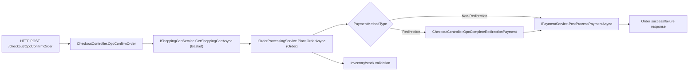

# Assignment 01 - Observability in the Wild

OpenTelemetry instrumentation for nopCommerce, focused on the flow:

**Customer places an order (Basket -> Order -> Payment -> Inventory)**.

This repository contains:
- architecture analysis: `ARCHITECTURE.md`
- critique: `CRITIQUE.md`
- load test script: `load-tests/checkout-opc.js`
- observability stack: `opentelemetry-demo/docker-compose.observability.yml`

---

## 1) Prerequisites

- Docker + Docker Compose
- .NET SDK 9 (or local SDK path configured)
- k6
- SQL Server running for nopCommerce

If using local .NET 9 SDK in home folder:

```bash
export DOTNET_ROOT=/home/tomasbras/dotnet-sdk-9.0.312-linux-x64
export PATH=$DOTNET_ROOT:$PATH
```

---

## 2) Run Observability Stack

```bash
docker compose -f opentelemetry-demo/docker-compose.observability.yml up -d
```

Endpoints:
- Grafana: `http://localhost:3000`
- Prometheus: `http://localhost:9090`
- Jaeger: `http://localhost:16686`
- OTEL Collector OTLP gRPC: `http://localhost:4317`

---

## 3) Run SQL Server for nopCommerce

nopCommerce in this repo is configured to use SQL Server at `localhost:1433` (`src/Presentation/Nop.Web/App_Data/appsettings.json`).

If you do not already have SQL Server running locally, start it with Docker:

```bash
docker run -d \
  --name nopcommerce_mssql_server \
  -e ACCEPT_EULA=Y \
  -e SA_PASSWORD='nopCommerce_db_password' \
  -p 1433:1433 \
  mcr.microsoft.com/mssql/server:2019-latest
```

If the container already exists:

```bash
docker start nopcommerce_mssql_server
```

Optional check:

```bash
docker logs -f nopcommerce_mssql_server
```

Wait until SQL Server reports it is ready for client connections.

---

## 4) Run nopCommerce with OpenTelemetry

From repository root:

```bash
OTEL_EXPORTER_OTLP_ENDPOINT=http://localhost:4317 \
dotnet run --project src/Presentation/Nop.Web/Nop.Web.csproj
```

Store URL:
- `http://localhost:5000`

---

## 5) Selected Flow Diagram



---

## 6) Run Load Test (k6)

The script generates mixed scenarios (success + controlled failures) to populate checkout, payment, drop-off, basket, and inventory metrics.

From repository root:

```bash
BASE_URL=http://localhost:5000 \
EMAIL=admin@yourStore.com \
PASSWORD='arquiteurasoftware' \
PRODUCT_ID=1 \
INVENTORY_QTY=2000 \
k6 run load-tests/checkout-opc.js
```

Notes:
- `PRODUCT_ID=0` tries to auto-discover a simple product from homepage.
- For reproducible runs, set a known simple product ID explicitly.
- For deterministic inventory failures, use a product with `Manage stock = true`, `Backorders = No backorders`, and low stock.

---

## 7) Dashboard Validation

Keep Grafana open while k6 is running and use time range `Last 15 minutes`.

Core checks in Prometheus:

```promql
sum by (result) (increase(checkout_attempts_total[5m]))
```

```promql
sum(increase(checkout_attempts_total{result!="success"}[5m])) / sum(increase(checkout_attempts_total[5m]))
```

```promql
histogram_quantile(0.95, sum(rate(checkout_duration_seconds_bucket[5m])) by (le))
```

```promql
sum by (provider, method, result) (increase(payment_attempts_total[5m]))
```

```promql
sum by (provider, reason_code) (increase(payment_failures_total[5m]))
```

Interpretation note for demo/evaluation: if payment queries return `0` (or payment panels show `No data`) while checkout/basket/inventory metrics are active, this is expected in this repository setup because checkout uses an offline/local payment path (no external gateway call).

---

## 8) Trace View (Jaeger)

Open: `http://localhost:16686`

Suggested filters:
- Service: `nop.web`
- Operation: `POST`
- Lookback: `Last Hour`

Then inspect traces around checkout requests and correlate with metric spikes.

---

## 9) Deliverables in Repo

- `ARCHITECTURE.md` - architecture reading + metric rationale
- `CRITIQUE.md` - architectural critique and surgical changes discussion
- `load-tests/checkout-opc.js` - load generation for selected flow
- observability compose/config under `opentelemetry-demo/`
